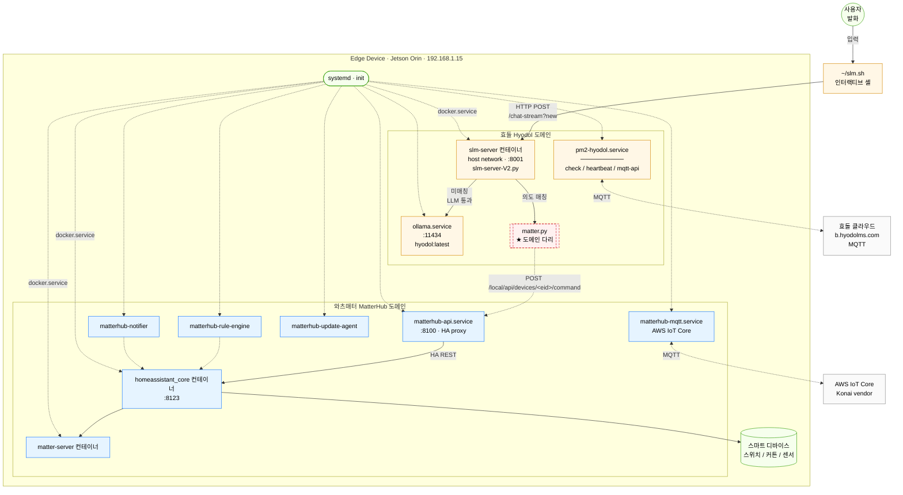

# 효돌-MatterHub 통합 아키텍처

## 1. 목적

본 문서는 효돌(Hyodol) 디바이스와 MatterHub가 한 호스트 위에 공존하면서 자연어 발화로 디바이스 제어가 동작하는 통합 구조를 한 장의 그림으로 정의한다.

[`docs/slm-intent-overview.md`](../slm-intent-overview.md)의 안내용 다이어그램을 기존 architecture 문서 체계 안에 흡수해, 추후 신규 디바이스/허브에서도 같은 그림을 기준으로 분석·연동할 수 있도록 한다.

상위/관련 문서:

- [라즈베리파이 납품용 패키징 및 운영 기획서](../raspberry-pi-delivery-plan.md)
- [systemd 서비스 설계](./systemd-service-design.md)
- [SLM 의도 분기 안내 (요약)](../slm-intent-overview.md)
- [작업 학습 로그 (2026-05-08)](../learn/20260508-slm-intent-control.md)

## 2. 통합 아키텍처 한 장



> 점선은 부팅 시 systemd가 부트스트랩하는 관계와 외부 클라우드 통신을, 실선은 사용자 발화 한 건의 데이터 흐름을 나타낸다. **주황 = 효돌, 파랑 = 와츠매터, 초록 = 공유, 빨강 점선 박스 = 도메인 다리(`matter.py`)** 로 색구분한다.

## 3. 도메인 책임 분리

| 영역 | 효돌(Hyodol) 도메인 | 와츠매터(MatterHub) 도메인 |
|------|---------------------|----------------------------|
| 역할 | 사용자 발화 수신·이해·응답 | 실제 디바이스 제어·상태 동기화·OTA |
| 프로세스 매니저 | Docker(slm-server) + 호스트 systemd(ollama) + PM2(pm2-hyodol) | 호스트 systemd(matterhub-* 6개) + Docker(matter-server, homeassistant_core) |
| 외부 클라우드 | `b.hyodolms.com` (효돌 자체 MQTT) | AWS IoT Core (Konai vendor) |
| 코드 위치 | `/home/hyodol/Hyodol/*` | `/home/whatsmatter/...` (matterhub-flask 배포본) |
| 인증·식별 | hyodol 사용자 + 효돌 클라우드 인증 | matterhub_id + Konai claim 인증 |

두 도메인은 같은 호스트에 공존하지만 **외부 채널·인증·코드 트리 모두 분리**되어 있다. 한 도메인이 죽어도 다른 도메인은 자기 채널로 계속 동작한다.

## 4. 도메인 간 다리: `matter.py`

이번 작업 이전에는 두 도메인이 서로의 존재를 모르고 동작했다. `matter.py`는 효돌 슬롯에 추가된 단일 Python 모듈로, 효돌 SLM의 `chat-stream` 핸들러가 의도 매칭 시 호출하여 와츠매터 영역의 `matterhub-api(:8100)`를 직접 부른다.

```python
# /home/hyodol/Hyodol/matter.py (요약)
API_BASE = 'http://127.0.0.1:8100/local/api'   # ← 와츠매터 진입점

def turn_on(idx=None):  # 효돌 도메인에서 호출
    # POST /devices/<eid>/command  body: {"domain":"switch","service":"turn_on"}
    ...
```

| 호출 방향 | 효돌 → 와츠매터 |
|----------|------------------|
| 프로토콜 | localhost HTTP (127.0.0.1:8100, host network 덕에 컨테이너에서도 도달) |
| 인증 | 없음 (loopback only) |
| 실패 시 영향 | 효돌 LLM 응답은 정상, 디바이스만 미변경 (timeout=3초) |

설계 원칙은 "**효돌 측 코드를 손대지 않으면 와츠매터는 영향 0**, 와츠매터 측 코드를 손대지 않으면 효돌은 영향 0". 두 도메인이 코드 수준에서 디커플링된 채 HTTP 한 줄로만 묶여 있어, 어느 한 쪽 마이그레이션·교체에 안전하다.

## 5. 통합 데이터 플로우 (한 발화)

`"불 켜줘"` 한 줄이 들어왔을 때 두 도메인을 가로지르는 흐름:

```text
사용자
  └─[1] bash ~/slm.sh                                                 ← 효돌
        └─[2] POST /chat-stream?new                  (slm-server :8001)← 효돌
              └─[3] 정규식 매칭: on_kw → idx 추출
                    └─[4] matter.py.turn_on(idx)                       ← 도메인 다리
                          └─[5] POST /local/api/devices/<eid>/command (matterhub-api :8100) ← 와츠매터
                                └─[6] HA REST POST /api/services/switch/turn_on (homeassistant_core :8123) ← 와츠매터
                                      └─[7] matter-server / Wi-Fi 통합 → 실제 디바이스 ON
        └─[8] 고정 SSE yield (LLM 호출 없이 즉시 반환)                  ← 효돌
              data: {"type":"sentence","data":"네! 불을 켜드렸어요~"}
              data: {"type":"end","data":"<END>"}
```

미매칭 발화(`"안녕"` 등)는 `[3]`에서 분기 미충족 → 효돌 도메인 안에서 ollama 추론으로 응답을 만들고 종료. 와츠매터 영역은 호출되지 않는다.

## 6. 부팅 시퀀스 (자동 복원)

| 순서 | systemd unit | 결과 |
|------|--------------|------|
| 1 | `docker.service` | 도커 데몬 기동 → restart 정책 컨테이너 자동 시작 (slm-server, matter-server, homeassistant_core) |
| 2 | `ollama.service` | 호스트 LLM 데몬 기동, 첫 요청 시 hyodol:latest 로드 |
| 3 | `matterhub-api`, `matterhub-mqtt`, `matterhub-rule-engine`, `matterhub-notifier`, `matterhub-update-agent` | 와츠매터 도메인 기동 |
| 4 | `pm2-hyodol.service` | PM2 데몬 → check/heartbeat/mqtt-api 복원 (효돌 클라우드 채널) |

ready 판정: `curl :8001/memory`에서 `models_loaded: true`, `systemctl is-active matterhub-api`. SLM 모델 로딩에 60~90초 소요.

## 7. 운영 영향 / 호환성

| 시나리오 | 효돌 동작 | 와츠매터 동작 |
|---------|-----------|----------------|
| `ollama.service` 중단 | 의도 매칭 발화는 정상, 일반 대화 실패 | 영향 없음 |
| `matterhub-api.service` 중단 | 일반 대화는 정상, 의도 매칭 시 `[matter demo] call failed` 후 SSE 응답까지는 도달하지만 디바이스 미변경 | 영향 없음 (자기 자신) |
| `slm-server` 컨테이너 중단 | 시연 셸 응답 안 옴 | 영향 없음 |
| 와츠매터 .deb 업데이트 / matterhub-api 재시작 | 의도 호출이 잠깐 5xx, 재시작 후 자동 회복 | 정상 흐름 |
| 효돌 측 코드 롤백 (백업 복원) | 의도 분기 비활성, 일반 대화·기존 효돌 동작은 유지 | 영향 없음 |

> 두 도메인이 디커플링되어 있어 **어느 한 쪽 장애가 다른 쪽으로 전파되지 않는다**. 이는 `matter.py`가 단방향 HTTP 호출 + timeout 3초 + try/except로 감싼 단일 다리이기 때문이다.

## 8. 확장 시 참고

다른 디바이스(허브)에 같은 패턴을 적용할 때:

- 효돌 SLM이 있는 디바이스: [`slm-intent-control` 스킬](../../.claude/skills/slm-intent-control/SKILL.md) — `slm-server-V2.py`에 의도 분기 추가/수정
- 효돌 없는 일반 매터허브 + 사용자가 ollama 등 LLM만 설치한 디바이스: [`llm-intent-bridge` 스킬](../../.claude/skills/llm-intent-bridge/SKILL.md) — 단일 `slm.py`로 두 도메인을 연결

두 스킬 모두 본 문서의 도메인 분리 그림을 기준 모델로 삼는다. 신규 entity (light/switch/cover/fan)를 추가할 때는 와츠매터 측 `app.py`의 `/local/api/devices/<entity_id>/command` 라우트가 받아주는 `domain` + `service` 쌍을 그대로 호출하면 되므로, 와츠매터 변경 없이 효돌 측 `matter.py` + 의도 분기 키워드만 추가하면 된다.
