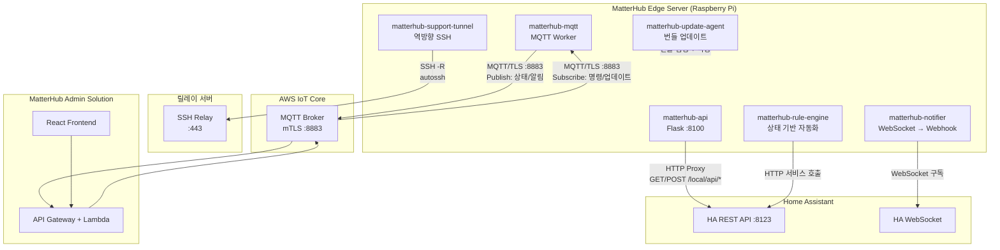
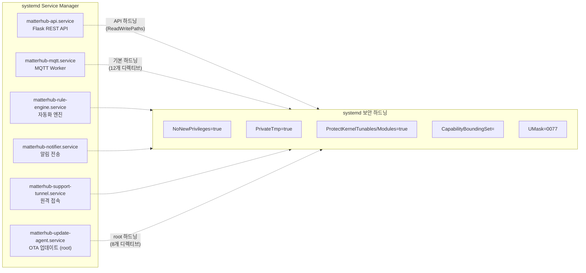
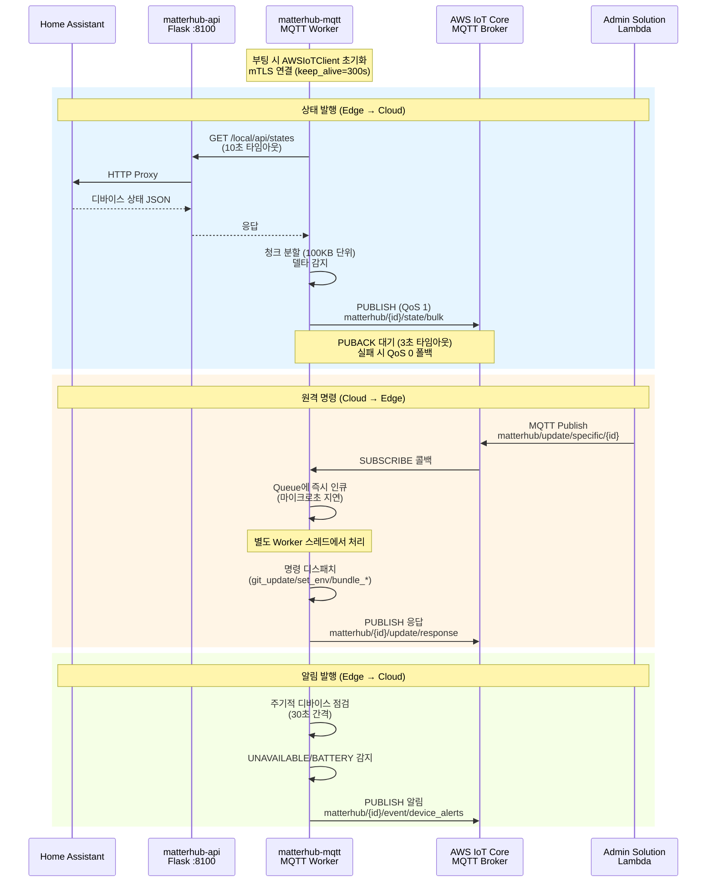
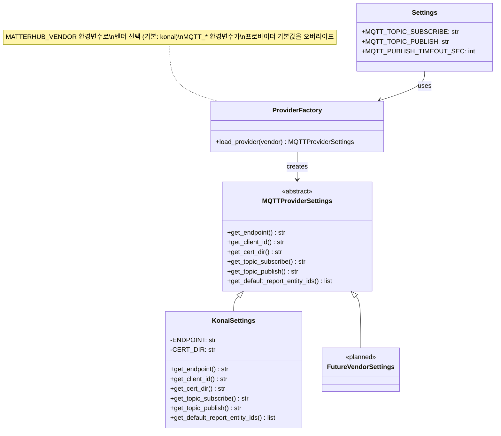
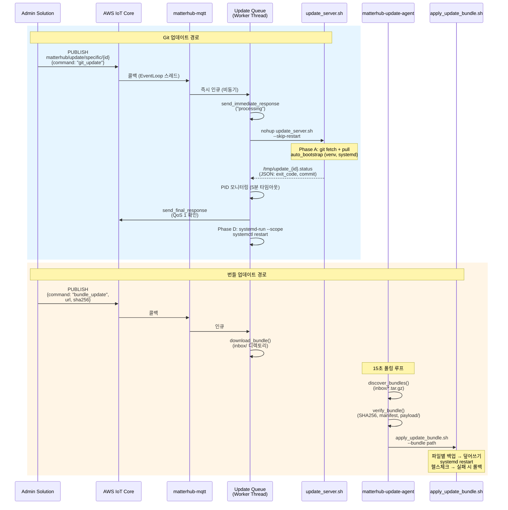
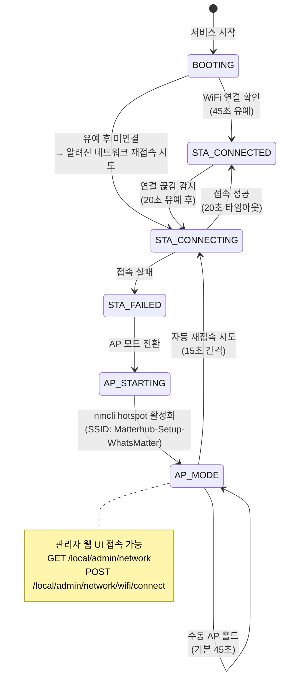
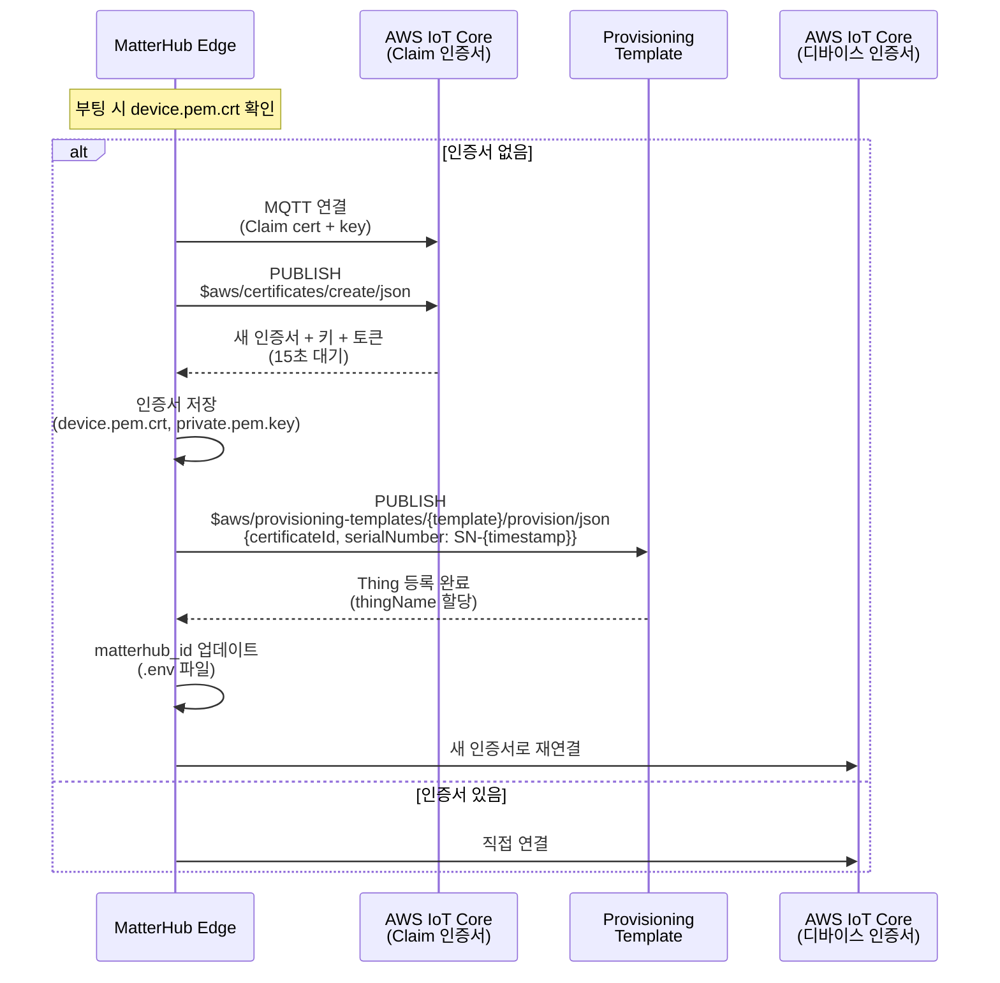
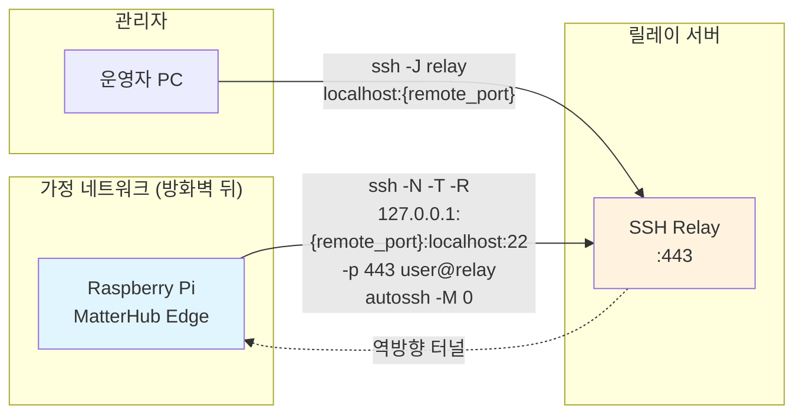

# MatterHub Edge Server — 아키텍처 문서

> 이 문서는 MatterHub Edge Server(IoT 게이트웨이)의 시스템 아키텍처를 다양한 표현 방식(Mermaid 다이어그램, 표, 텍스트 서술)으로 정리한 참조 문서입니다.

---

## 1. 시스템 개요

**프로젝트 목적:** 가정에 설치된 Raspberry Pi 기반 IoT 게이트웨이로, Home Assistant와 AWS IoT Core를 브리징하여 스마트홈 디바이스를 원격으로 모니터링·제어한다.

**기술 스택:**

| 계층 | 기술 |
|------|------|
| Runtime | Python 3.9+ (Ubuntu 24.04 LTS on Raspberry Pi 4+) |
| Web Framework | Flask (REST API, port 8100) |
| MQTT | AWS IoT Core (awscrt/awsiot SDK, mTLS) |
| Process Management | systemd (6개 독립 서비스) |
| Network | NetworkManager (nmcli), autossh |
| Packaging | .deb (dpkg-deb, .pyc 컴파일 배포) |
| Provisioning | AWS IoT Claim 기반 자동 인증서 발급 |
| Vendor Abstraction | Provider Factory 패턴 (기본: Konai) |

---

## 2. Mermaid 다이어그램

### 2.1 전체 시스템 아키텍처



### 2.2 멀티 프로세스 아키텍처



### 2.3 MQTT 메시지 흐름



### 2.4 벤더 추상화 아키텍처 (Provider 패턴)



### 2.5 디바이스 업데이트 파이프라인



### 2.6 Wi-Fi 프로비저닝 & AP 부트스트랩



### 2.7 Claim 기반 디바이스 프로비저닝



### 2.8 역방향 SSH 터널



---

## 3. 표 형식 정리

### 3.1 systemd 서비스 정의

| # | 서비스 | 엔트리 포인트 | 실행 사용자 | 하드닝 프로파일 | 역할 |
|---|--------|--------------|------------|----------------|------|
| 1 | matterhub-api | `app.py` | matterhub | API 하드닝 | Flask REST API (port 8100), Home Assistant HTTP 프록시 |
| 2 | matterhub-mqtt | `mqtt.py` | matterhub | 기본 하드닝 (12개) | AWS IoT Core MQTT 클라이언트, 상태 발행/명령 수신 |
| 3 | matterhub-rule-engine | `sub/ruleEngine.py` | matterhub | 기본 하드닝 (12개) | 상태 변화 기반 자동화 규칙 엔진 |
| 4 | matterhub-notifier | `sub/notifier.py` | matterhub | 기본 하드닝 (12개) | WebSocket 이벤트 → Webhook 알림 전송 |
| 5 | matterhub-support-tunnel | `support_tunnel.py` | matterhub | 기본 하드닝 (12개) | 역방향 SSH 터널 (기본 비활성) |
| 6 | matterhub-update-agent | `update_agent.py` | **root** | root 하드닝 (8개) | OTA 번들 업데이트 검증 및 적용 |

### 3.2 systemd 보안 하드닝 디렉티브

| 디렉티브 | 기본 (12개) | API | root (8개) | 효과 |
|----------|:-----------:|:---:|:----------:|------|
| NoNewPrivileges=true | ✅ | — | — | 프로세스 권한 상승 차단 |
| PrivateTmp=true | ✅ | ✅ | ✅ | 독립 /tmp 네임스페이스 |
| ProtectSystem=false | ✅ | ✅ | ✅ | 파일시스템 접근 허용 (업데이트용) |
| ProtectControlGroups=true | ✅ | ✅ | ✅ | cgroup 변경 차단 |
| ProtectKernelTunables=true | ✅ | ✅ | ✅ | sysctl 변경 차단 |
| ProtectKernelModules=true | ✅ | ✅ | ✅ | 커널 모듈 로드 차단 |
| RestrictSUIDSGID=true | ✅ | — | — | SUID/SGID 파일 생성 차단 |
| LockPersonality=true | ✅ | ✅ | ✅ | 실행 도메인 변경 차단 |
| RestrictRealtime=true | ✅ | ✅ | ✅ | 실시간 스케줄링 차단 |
| CapabilityBoundingSet= | ✅ | — | — | 모든 Linux capability 제거 |
| AmbientCapabilities= | ✅ | — | — | Ambient capability 제거 |
| UMask=0077 | ✅ | ✅ | ✅ | 생성 파일 소유자만 접근 |
| ReadWritePaths=/etc/matterhub | — | ✅ | — | .env 설정 파일 쓰기 허용 |

### 3.3 MQTT 토픽 구조

| 토픽 패턴 | 방향 | QoS | 용도 |
|-----------|------|-----|------|
| `matterhub/{hub_id}/state/bulk` | Edge → Cloud | 1 (폴백: 0) | 디바이스 상태 벌크 발행 (청킹) |
| `matterhub/{hub_id}/event/device_alerts` | Edge → Cloud | 1 (폴백: 0) | UNAVAILABLE/BATTERY 알림 |
| `matterhub/{hub_id}/update/response` | Edge → Cloud | 1 | 업데이트 명령 실행 결과 |
| `matterhub/update/specific/{hub_id}` | Cloud → Edge | 1 | 개별 디바이스 업데이트 명령 |
| `matterhub/update/all` | Cloud → Edge | 1 | 전체 디바이스 브로드캐스트 명령 |
| `matterhub/update/region/{region}` | Cloud → Edge | 1 | 지역별 업데이트 명령 |
| `matterhub/{hub_id}/state-changed` | Cloud → Edge | 1 | 상태 변경 알림 (구독용) |
| `$aws/certificates/create/json` | Edge → Cloud | 1 | Claim 인증서 발급 요청 |
| `$aws/provisioning-templates/{tpl}/provision/json` | Edge → Cloud | 1 | Thing 등록 요청 |

### 3.4 Flask API 엔드포인트

| 경로 | 메서드 | 역할 |
|------|--------|------|
| `/local/api/states` | GET | 전체 디바이스 상태 조회 (HA 프록시) |
| `/local/api/states/<entity_id>` | GET | 개별 디바이스 상태 조회 |
| `/local/api/services` | GET | HA 서비스 목록 조회 |
| `/local/api/devices/<entity_id>/command` | POST | HA 서비스 호출 (디바이스 제어) |
| `/local/api/devices/<entity_id>/status` | GET | 디바이스 상태 조회 |
| `/local/api/devices` | CRUD | 관리 디바이스 목록 CRUD |
| `/local/api/schedules` | CRUD | 스케줄 CRUD |
| `/local/api/rules` | CRUD | 자동화 규칙 CRUD |
| `/local/api/rooms` | CRUD | 방 구성 CRUD |
| `/local/api/notifications` | CRUD | 알림 설정 CRUD |
| `/local/api/config/ha/cert` | POST/DELETE/PUT | HA 토큰 설정 |
| `/local/api/config/aws/cert` | POST/DELETE/PUT | AWS 인증서 관리 |
| `/local/api/config/aws/id` | POST/DELETE/PUT | matterhub_id 설정 |
| `/local/api/matterhub/id` | GET | matterhub_id 조회 |
| `/local/admin/network` | GET | Wi-Fi 관리 웹 UI |
| `/local/admin/network/status` | GET | 네트워크 상태 JSON |
| `/local/admin/network/wifi/scan` | GET | Wi-Fi 네트워크 스캔 |
| `/local/admin/network/wifi/connect` | POST | Wi-Fi 접속 |
| `/local/admin/network/wifi/saved` | GET/DELETE | 저장된 Wi-Fi 프로파일 관리 |
| `/local/admin/network/recovery/ap-mode` | POST | 수동 AP 모드 전환 |

### 3.5 MQTT 명령 타입

| 명령 | 페이로드 예시 | 처리 위치 | 설명 |
|------|-------------|----------|------|
| `git_update` | `{command: "git_update", branch: "master", force_update: false}` | `update.py → update_server.sh` | Git pull + 서비스 재시작 |
| `set_env` | `{command: "set_env", key: "MQTT_EVENT_THROTTLE_SEC", value: "5"}` | `update.py → _handle_set_env` | .env 원격 수정 (7개 키 허용) |
| `bundle_update` | `{command: "bundle_update", url: "https://...", sha256: "abc..."}` | `update.py → download_bundle` | 번들 다운로드 → inbox |
| `bundle_check` | `{command: "bundle_check"}` | `update.py → _handle_bundle_check` | inbox 번들 목록 조회 |

**원격 수정 허용 .env 키 (7개):**

| 키 | 기본값 | 용도 |
|----|--------|------|
| `MATTERHUB_REGION` | — | 지역별 업데이트 대상 |
| `SUBSCRIBE_MATTERHUB_TOPICS` | `"1"` | matterhub/* 토픽 구독 여부 |
| `MQTT_EVENT_THROTTLE_SEC` | `2` | 이벤트 최소 발행 간격 (초) |
| `MQTT_EVENT_DEDUP_WINDOW_SEC` | `3` | 중복 이벤트 제거 윈도우 (초) |
| `MQTT_DEVICE_STATE_INTERVAL_SEC` | `60` | 디바이스 상태 발행 주기 (초) |
| `MQTT_ALERT_CHECK_INTERVAL_SEC` | `30` | 알림 점검 주기 (초) |
| `MQTT_ALERT_BATTERY_THRESHOLD` | `0` | 배터리 알림 임계값 (%, 0=비활성) |

### 3.6 .env 설정 계층

```
우선순위: 환경변수 > .env 파일 > 벤더 프로바이더 기본값
```

| 설정 그룹 | 키 | 기본값 | 출처 |
|----------|-----|--------|------|
| **HA 연동** | `HA_host` | `http://localhost:8123` | .env |
| | `hass_token` | — | .env |
| **디바이스 ID** | `matterhub_id` | — | .env (프로비저닝 시 자동 설정) |
| **벤더 선택** | `MATTERHUB_VENDOR` | `"konai"` | .env |
| **MQTT 연결** | `MQTT_ENDPOINT` | 프로바이더 | .env > 프로바이더 |
| | `MQTT_CLIENT_ID` | 프로바이더 | .env > 프로바이더 |
| | `MQTT_CERT_PATH` | 프로바이더 | .env > 프로바이더 |
| **MQTT 토픽** | `MQTT_TOPIC_SUBSCRIBE` | 프로바이더 | .env > 프로바이더 |
| | `MQTT_TOPIC_PUBLISH` | 프로바이더 | .env > 프로바이더 |
| **이벤트 제어** | `MQTT_EVENT_THROTTLE_SEC` | `2` | .env |
| | `MQTT_EVENT_DEDUP_WINDOW_SEC` | `3` | .env |
| | `MQTT_PUBLISH_TIMEOUT_SEC` | `3` | .env |
| **상태 발행** | `MQTT_DEVICE_STATE_INTERVAL_SEC` | `60` (최소 10) | .env |
| | `MQTT_DEVICE_STATE_CHUNK_SIZE_KB` | `100` (최소 10) | .env |
| **알림** | `MQTT_ALERT_CHECK_INTERVAL_SEC` | `30` (최소 5) | .env |
| | `MQTT_ALERT_BATTERY_THRESHOLD` | `0` (0=비활성) | .env |
| **업데이트 구독** | `SUBSCRIBE_MATTERHUB_TOPICS` | `"1"` | .env |
| | `MATTERHUB_REGION` | — | .env |
| **프로비저닝** | `MATTERHUB_AUTO_PROVISION` | `"1"` | .env |
| **터널** | `SUPPORT_TUNNEL_ENABLED` | `"0"` | .env |
| | `SUPPORT_TUNNEL_HOST` | — | .env |
| | `SUPPORT_TUNNEL_REMOTE_PORT` | — | .env |
| **Wi-Fi** | `WIFI_AUTO_AP_ON_BOOT` | `"0"` | .env |
| | `WIFI_AUTO_AP_ON_DISCONNECT` | `"0"` | .env |

---

## 4. 텍스트 서술

### 4.1 멀티 프로세스 아키텍처

MatterHub Edge는 6개 독립 systemd 서비스로 구성된다. 각 서비스는 격리된 프로세스로 실행되어 단일 서비스 장애가 전체 시스템으로 전파되지 않는다.

**프로세스 간 통신:**
- **matterhub-api ↔ Home Assistant**: HTTP 프록시 (Flask가 HA REST API를 래핑)
- **matterhub-mqtt ↔ AWS IoT Core**: awscrt SDK의 MQTT 연결 (EventLoopGroup(1) 단일 스레드)
- **matterhub-mqtt ↔ matterhub-api**: HTTP 내부 호출 (`http://localhost:8100/local/api/*`)
- **matterhub-notifier ↔ Home Assistant**: WebSocket 구독으로 실시간 이벤트 수신
- **matterhub-update-agent**: 파일시스템 폴링 (`update/inbox/` 디렉토리, 15초 간격)

**서비스 재시작 정책:** 모든 서비스는 `Restart=always`, `RestartSec=5`로 설정되어 크래시 시 5초 후 자동 재시작된다.

### 4.2 MQTT 연결 관리

**연결 설정:**
- AWS IoT Core SDK (`awscrt`, `awsiot`) 사용
- mTLS 인증 (device.pem.crt + private.pem.key + AmazonRootCA1.pem)
- `keep_alive_secs=300` (5분 간격 PINGREQ)
- `clean_session=False` (세션 유지)
- 연결 타임아웃: 10초

**재연결 전략:**
- 최대 5회 재연결 시도
- 지수 백오프: `2^attempt` 초 + `random.uniform(1, 3)` 지터
- 30초 간격 연결 상태 점검 (`check_mqtt_connection`)
- 재연결 시 모든 토픽 재구독 (최대 3회 재시도, 지수 백오프)

**QoS 폴백 전략:**
1. QoS 1 (AT_LEAST_ONCE)로 발행 시도
2. PUBACK 타임아웃(3초) 또는 예외 발생 시
3. QoS 0 (AT_MOST_ONCE)로 재발행 — 메시지 유실 최소화

### 4.3 보안 아키텍처

| 계층 | 메커니즘 | 구현 |
|------|---------|------|
| **전송 보안** | mTLS | awscrt SDK, X.509 클라이언트 인증서, AmazonRootCA1 |
| **디바이스 인증** | Claim 프로비저닝 | AWS IoT Fleet Provisioning Template |
| **복제 방지** | MAC 바인딩 | 네트워크 인터페이스 MAC 주소 화이트리스트 검증 |
| **프로세스 격리** | systemd 하드닝 | NoNewPrivileges, PrivateTmp, CapabilityBoundingSet 등 12개 디렉티브 |
| **원격 접속** | SSH 역방향 터널 | autossh + ExitOnForwardFailure, 지수 백오프 재접속 |
| **코드 보호** | .pyc 배포 | 빌드 시 .py 컴파일 → .pyc, 원본 .py 삭제 |
| **파일 권한** | UMask=0077 | 생성 파일 소유자만 읽기/쓰기/실행 |
| **원격 설정** | 화이트리스트 키 | set_env 명령은 7개 허용 키만 수정 가능 |

### 4.4 데이터 흐름 요약

**1. 상태 발행 루프 (matterhub-mqtt):**
```
[5초 간격] → fetch HA states → delta 감지 → 100KB 청크 분할 → MQTT QoS 1 발행
[60초 간격] → 벌크 디바이스 상태 발행 (managed entities)
[30초 간격] → UNAVAILABLE/BATTERY 알림 점검 → 알림 발행
```

**2. 원격 명령 처리 (matterhub-mqtt):**
```
MQTT 콜백 (EventLoop) → Queue 인큐 (μs) → Worker 스레드 디스패치 →
  git_update: nohup update_server.sh → PID 모니터 → 응답 → systemd restart
  set_env: .env 파일 수정 (화이트리스트 키) → 선택적 재시작
  bundle_update: HTTP 다운로드 → inbox/ 저장
  bundle_check: inbox/ 목록 응답
```

**3. OTA 번들 적용 (matterhub-update-agent, root):**
```
[15초 폴링] inbox/*.tar.gz 탐색 → SHA256 검증 → manifest.json 확인 →
  payload/ 추출 → 파일별 백업 → 덮어쓰기 → systemd restart →
  헬스체크 → 실패 시 자동 롤백 (백업 복원 + NEW_FILES 삭제)
```

**4. Wi-Fi 프로비저닝 (matterhub-api 내 스레드):**
```
[부팅] 45초 유예 → WiFi 연결 확인 → 미연결 시 알려진 네트워크 재접속 →
  실패 시 AP 모드 (Matterhub-Setup-WhatsMatter) →
  [5초 간격] 연결 끊김 감시 → 20초 유예 후 AP 모드 전환 →
  [15초 간격] 자동 STA 재접속 시도
```

### 4.5 빌드 & 배포 파이프라인

**.deb 패키지 빌드 (`build_matterhub_deb.sh`):**

```
소스 코드 → rsync 선택적 복사 → (선택) .pyc 컴파일 + .py 삭제 →
  6개 서비스 런처 스크립트 생성 → 7개 systemd unit 렌더링 →
  DEBIAN 패키지 메타데이터 (control, postinst, prerm, postrm) →
  dpkg-deb 빌드 → {PACKAGE}_{VERSION}_{ARCH}.deb
```

**postinst 설치 후처리:**
1. matterhub 사용자 생성
2. Python venv 생성 + pip install
3. .py → .pyc 컴파일 + .py 삭제
4. systemd unit 활성화 + 시작
5. UFW 방화벽 규칙 설정

---

## 5. ASCII 다이어그램

Mermaid 렌더링이 불가한 환경을 위한 고수준 아키텍처 다이어그램:

```
┌─────────────────────────────────────────────────────────────────────────────┐
│                      MatterHub Edge Server (Raspberry Pi)                  │
│                                                                             │
│  ┌──────────────┐  ┌──────────────┐  ┌──────────────┐  ┌──────────────┐   │
│  │ matterhub-api│  │matterhub-mqtt│  │  rule-engine │  │   notifier   │   │
│  │  Flask :8100 │  │  MQTT Worker │  │  자동화 엔진 │  │ WS → Webhook │   │
│  └──────┬───────┘  └──────┬───────┘  └──────┬───────┘  └──────┬───────┘   │
│         │                 │                  │                  │           │
│  ┌──────┴───────┐  ┌──────┴───────┐  ┌──────┴──────────────────┘           │
│  │support-tunnel│  │ update-agent │  │                                     │
│  │ autossh -R   │  │ root, 15s폴링│  │  Home Assistant :8123               │
│  └──────┬───────┘  └──────┬───────┘  │  (HTTP API + WebSocket)             │
│         │                 │          └──────────────────────────            │
└─────────┼─────────────────┼────────────────────────────────────────────────┘
          │                 │
          │  SSH :443       │  inbox/*.tar.gz
          ▼                 │
   ┌──────────────┐         │
   │ 릴레이 서버   │         │
   │ (관리자 접속) │         │
   └──────────────┘         │
                            │
   ┌────────────────────────┼────────────────────────────────────────────────┐
   │                        │         AWS IoT Core                          │
   │                        │                                                │
   │  MQTT/TLS :8883 ◄─────┴──── mTLS (X.509)                              │
   │                                                                         │
   │  Topics:                                                                │
   │    Edge→Cloud: matterhub/{id}/state/bulk                                │
   │                matterhub/{id}/event/device_alerts                       │
   │                matterhub/{id}/update/response                           │
   │    Cloud→Edge: matterhub/update/specific/{id}                           │
   │                matterhub/update/all                                      │
   │                matterhub/update/region/{region}                          │
   └────────────────────────────────────────────────────────────────────────┘
```
